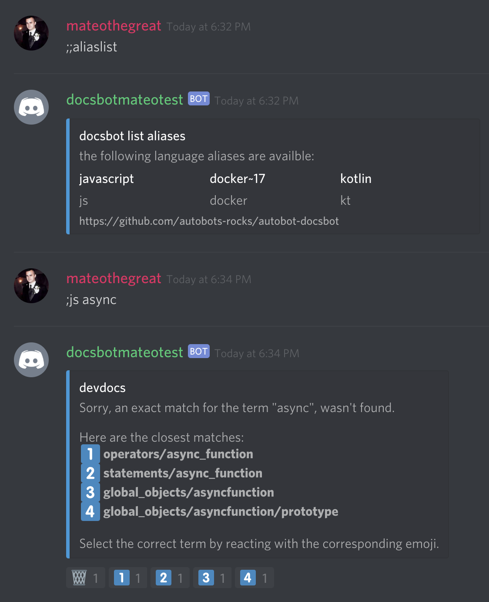
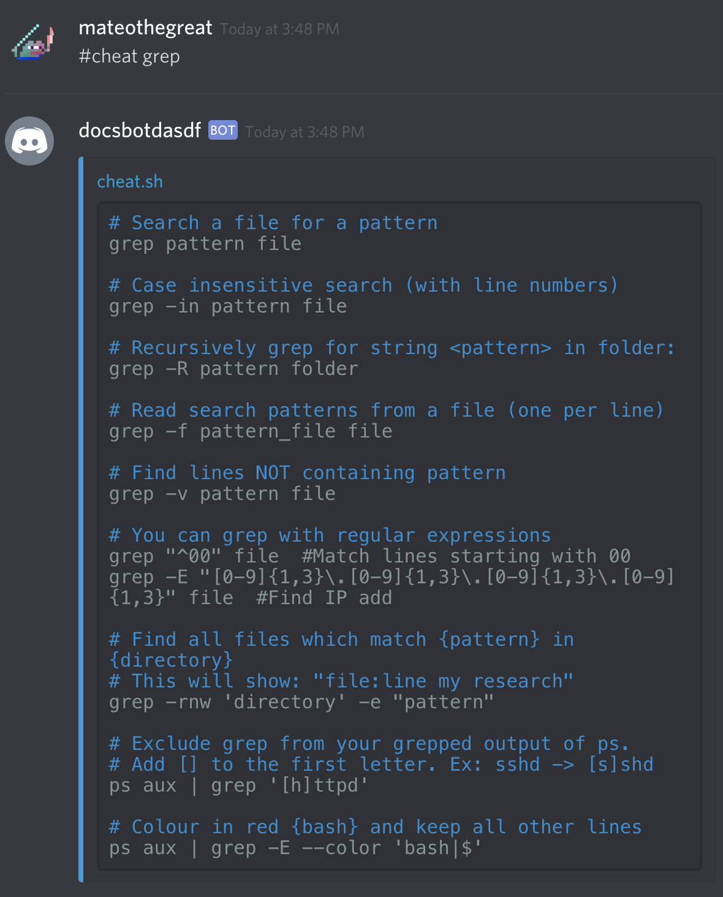

  



# devdocs.io + cheat.sh discord bot

Queries [devdocs.io](https://devdocs.io/) json schema for names via !js strict_mode etc.
This bot comes with a simple monitoring endpoint for monitoring the bot being up (used with kubernetes).
This bot uses the ___docsbot___ role by default for users who are allowed to query.

__Additionally, this bot comes with the `;;ping` command to show bot latency and uptime.__

## Commands

| Command                                       | Description                                               |
|-----------------------------------------------|-----------------------------------------------------------|
| `;<language> <function>`                      | Searches <language> for <function>                        |
| `;;update <language>`                         | Downloads a language pack from devdocs.io.                |
| `;;list`                                      | Lists downloaded language packs.                          |
| `;;terms <language>`                          | Lists terms searchable by language pack.                  |
| `;;cheat <command>`                           | Displays documentation from cheat.sh for a command.       |
| `;;aliaslist`                                 | Lists configured aliases.                                 |
| `;;aliasadd language=javascript,alias=js`     | Create or replace a new language alias.                   |
| `;;aliasdelete language=javascript`           | Deletes alias(es) associated with a language.             |
    
    
## Setup
Clone the repo, run `npm install` inside of it, and copy the template `.env` file.

```bash
git clone https://github.com/autobots-rocks/autobot-docsbot
cd autobot-docsbot
npm install
cp .env.sample .env
```

The `.env` file has the following configurable options which are required:

```bash
PORT=8080
TOKEN=<your discord bot token>

#
# Initial configuration
#
DOCSBOT_SAVE_PATH=<some full path to a direcgtory save json files to>
DOCSBOT_ADMIN_ROLE_NAME=docsbot
DOCSBOT_LIMIT_CHARS=1000

#
# Command Prefixes
#
DOCSBOT_PREFIX_SEARCH=;
DOCSBOT_PREFIX_CHEAT=;;cheat
DOCSBOT_PREFIX_LIST=;;list
DOCSBOT_PREFIX_TERMS=;;terms
DOCSBOT_PREFIX_UPDATE=;;update

#
# Aliases Configuration
#
DOCSBOT_ALIASES_CONFIG_PATH=<some path>.json
DOCSBOT_PREFIX_ALIAS_ADD=;;aliasadd
DOCSBOT_PREFIX_ALIAS_LIST=;;aliaslist
DOCSBOT_PREFIX_ALIAS_DELETE=;;aliasdelete

```


Make sure the role you specified exists and is assigned to the user(s) that want to use any of the docsbot commands!

## Building
```bash
npm run build
```

## Starting

`npm run start`

```bash
± |master S:395 U:390 ?:598 ✗| → npm run start

> @autobots/autobot-docsbot@1.0.0 start /Users/yomateod/workspace/work/autobots/autobot-docsbot
> node dist/main.js

[Nest] 11223   - 06/02/2019, 2:01 PM   [NestFactory] Starting Nest application...
Sun Jun 02 2019 14:01:52 GMT-0500 (Central Daylight Time): Logging into discord
[Nest] 11223   - 06/02/2019, 2:01 PM   [InstanceLoader] AppModule dependencies initialized +494ms
[Nest] 11223   - 06/02/2019, 2:01 PM   [InstanceLoader] MonitoringModule dependencies initialized +0ms
[Nest] 11223   - 06/02/2019, 2:01 PM   [RoutesResolver] MonitoringController {/monitoring}: +4ms
[Nest] 11223   - 06/02/2019, 2:01 PM   [RouterExplorer] Mapped {/is_alive, GET} route +2ms
[Nest] 11223   - 06/02/2019, 2:01 PM   [NestApplication] Nest application successfully started +2ms
Sun Jun 02 2019 14:01:52 GMT-0500 (Central Daylight Time): Bootstrapping /Users/yomateod/workspace/work/autobots/autobot-docsbot/node_modules/@autobot/module-docsbot
Sun Jun 02 2019 14:01:52 GMT-0500 (Central Daylight Time): Command Registered: !js (!js <search term>)
Sun Jun 02 2019 14:01:52 GMT-0500 (Central Daylight Time): Bot Started
Sun Jun 02 2019 14:01:53 GMT-0500 (Central Daylight Time): Connected to discord
```

## Installing languages

Once up and running you'll need to install languages that match devdocs.io.
i.e.:

```bash
;;update javascript
;;update kotlin
```

## Monitoring
The monitoring endpoint is available at http://localhost:8080/monitoring/is_alive.

## Docker
This bot comes with its own `Dockerfile`.

### Building
```bash
docker build -t docsbot .
```

### Running 
```bash
docker run -d -p8080:8080 --name docsbot docsbot
```

### Viewing Logs
```bash
 docker logs -f docsbot
```
 
### Stopping
```bash
 docker rm -f docsbot
```

## Kubernetes
To deploy to kubernetes simply run the `make install` command. 
This will `kubectl apply` the files in the manifests directory installing the deployment and service.
You will want to edit the image name in the Makefile or the deployment.yaml file.
